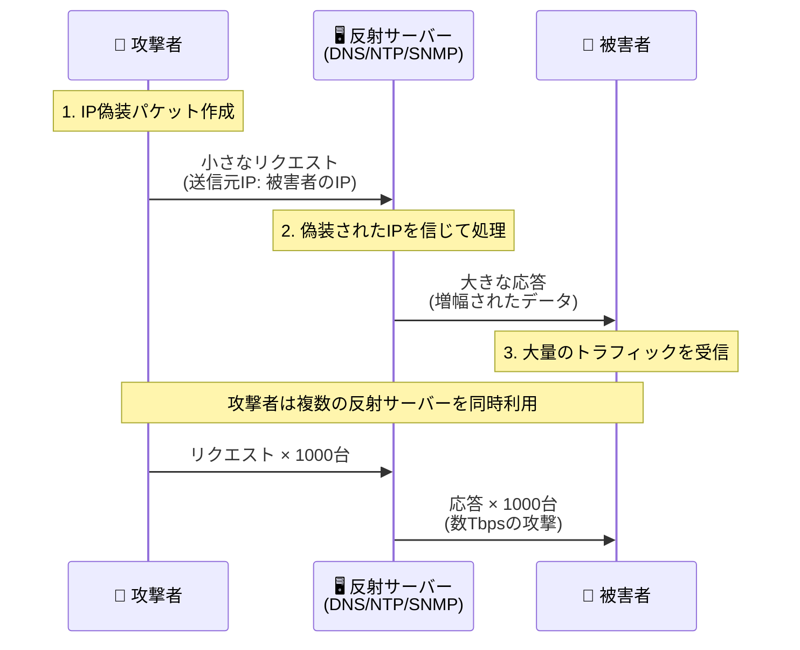
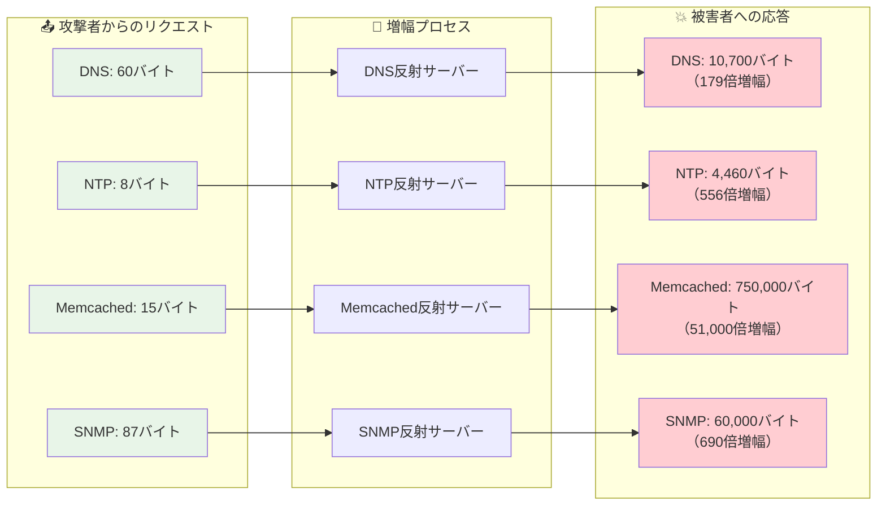
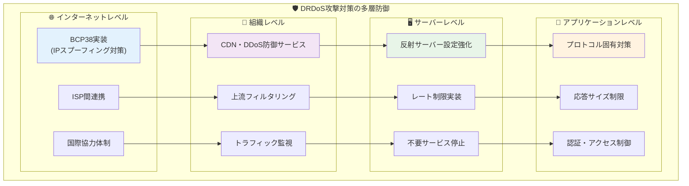

# DRDoS攻撃入門

## 目次
1. [DRDoS攻撃とは](#drdos攻撃とは)
2. [DRDoS攻撃の仕組み](#drdos攻撃の仕組み)
3. [主要な攻撃プロトコル](#主要な攻撃プロトコル)
4. [具体的な攻撃事例](#具体的な攻撃事例)
5. [攻撃の検出方法](#攻撃の検出方法)
6. [対策と防御方法](#対策と防御方法)
7. [まとめ](#まとめ)

## DRDoS攻撃とは

**DRDoS**（Distributed Reflection Denial of Service）攻撃は、**分散反射型サービス拒否攻撃**と呼ばれる、DDoS攻撃の一種です。

### 🎯 DRDoS攻撃の特徴

1. **反射攻撃**: 第三者のサーバーを「踏み台」として利用
2. **増幅効果**: 小さなリクエストで大きな応答を生成
3. **送信元偽装**: 攻撃者の身元を隠蔽
4. **分散攻撃**: 複数の反射サーバーを同時利用

### 💡 身近な例で理解しよう

DRDoS攻撃を郵便システムに例えると：

```
1. 攻撃者が被害者の住所を差出人として偽装
2. 大量の「着払い荷物」を様々な配送業者に依頼
3. 配送業者は偽装された住所（被害者）に荷物を配達
4. 被害者は身に覚えのない大量の荷物と請求を受け取る
```

このように、攻撃者は直接攻撃せず、第三者を利用して被害者に負荷をかけます。

### 🔄 従来のDDoS攻撃との違い

| 項目 | 従来のDDoS攻撃 | DRDoS攻撃 |
|------|---------------|-----------|
| **攻撃方法** | 直接攻撃 | 反射攻撃 |
| **必要リソース** | 大量のボット | 少数のボット + 反射サーバー |
| **増幅率** | 1:1 | 最大1:4000以上 |
| **攻撃者追跡** | 比較的容易 | 非常に困難 |
| **対策難易度** | 中程度 | 高難易度 |

## DRDoS攻撃の仕組み

### 🔄 攻撃の基本フロー

DRDoS攻撃は以下の3つのステップで実行されます：

1. **IP偽装** 🎭
2. **反射サーバーへのリクエスト** 📡
3. **増幅された応答の送信** 💥



### 詳細な攻撃プロセス

#### ステップ1: IP偽装 🎭

```
攻撃者のリクエスト:
送信元IP: 192.168.1.100 (被害者のIP) ← 偽装！
宛先IP: 8.8.8.8 (反射サーバー)
```

攻撃者は、被害者のIPアドレスを送信元として偽装したパケットを作成します。

#### ステップ2: 反射サーバーへのリクエスト 📡

偽装されたリクエストを、DNSやNTPなどのプロトコルを提供する**反射サーバー**（リフレクター）に送信します。

#### ステップ3: 増幅された応答 💥

```
反射サーバーの応答:
送信元IP: 8.8.8.8 (反射サーバー)
宛先IP: 192.168.1.100 (被害者のIP)
データサイズ: リクエストの数十倍〜数千倍
```

反射サーバーは、偽装されたIPアドレス（被害者）に対して、リクエストよりもはるかに大きな応答を送信します。

### 🔢 増幅効果の威力

| プロトコル | 増幅率 | リクエストサイズ | 応答サイズ |
|-----------|--------|----------------|-----------|
| **DNS** | 最大179倍 | 60バイト | 最大10,700バイト |
| **NTP** | 最大556倍 | 8バイト | 最大4,460バイト |
| **SNMP** | 最大6.3倍 | 87バイト | 最大60,000バイト |
| **Memcached** | 最大51,000倍 | 15バイト | 最大750,000バイト |
| **LDAP** | 最大46倍 | 30バイト | 最大1,389バイト |

**例**: 1MbpsのMemcached攻撃が、最大51Gbpsの攻撃に増幅される可能性があります。



## 主要な攻撃プロトコル

### 1. 🌐 DNS反射攻撃

**概要**: DNSクエリを利用した最も一般的なDRDoS攻撃

**攻撃手法**:
- `ANY`クエリや`TXT`レコードクエリを使用
- 大きな応答を返すドメインを標的に選択
- オープンDNSリゾルバーを反射サーバーとして悪用

**攻撃例**:
```
リクエスト: dig ANY example.com @8.8.8.8 (60バイト)
応答: すべてのレコードタイプの情報 (最大10,700バイト)
```

### 2. ⏰ NTP反射攻撃

**概要**: Network Time Protocolの`monlist`コマンドを悪用

**攻撃手法**:
- `monlist`コマンドで最近の600クライアントの情報を要求
- 古いNTPサーバー（バージョン4.2.7以前）が対象
- 小さなクエリで大量のデータを取得

**攻撃例**:
```
リクエスト: ntpdc -c monlist (8バイト)
応答: 600クライアント分の情報 (最大4,460バイト)
```

### 3. 📊 SNMP反射攻撃

**概要**: Simple Network Management Protocolを利用

**攻撃手法**:
- `GetBulkRequest`コマンドを使用
- ネットワーク機器の大量の管理情報を要求
- プリンターやルーターが主な反射サーバー

### 4. 💾 Memcached反射攻撃

**概要**: 2018年に発見された最も強力な増幅攻撃

**攻撃手法**:
- インターネットに露出したMemcachedサーバーを悪用
- 事前に大量データを保存してから攻撃実行
- 史上最大級の増幅率を実現

**歴史的事例**:
- **2018年GitHub攻撃**: 11.35Tbpsの攻撃
- **2018年Arbor Networks観測**: 1.7Tbpsの攻撃

### 5. 📁 LDAP反射攻撃

**概要**: Lightweight Directory Access Protocolを利用

**攻撃手法**:
- ディレクトリサービスへの検索クエリを悪用
- Active DirectoryやOpenLDAPサーバーが対象
- 組織内の大量のユーザー情報を返答として利用

## 具体的な攻撃事例

### 🎯 GitHub攻撃（2018年2月）

**攻撃規模**: 1.35Tbps
**攻撃手法**: Memcached反射攻撃
**継続時間**: 約10分間
**影響**: GitHubサービスが断続的に利用不可

**攻撃の詳細**:
- 数千台のMemcachedサーバーを反射サーバーとして利用
- 攻撃者は事前に大量のデータをMemcachedに保存
- 小さなリクエストで最大750KBの応答を生成

### 🏢 Arbor Networks観測攻撃（2018年3月）

**攻撃規模**: 1.7Tbps（当時の世界記録）
**攻撃手法**: Memcached反射攻撃
**特徴**: 複数の標的に対する同時攻撃

### 🎮 ゲーム業界への攻撃（2019年）

**標的**: オンラインゲームサービス
**攻撃手法**: DNS + NTP反射攻撃の組み合わせ
**影響**: 数日間にわたるサービス停止

### 📺 放送業界への攻撃（2020年）

**標的**: ストリーミング配信サービス
**攻撃手法**: LDAP反射攻撃
**特徴**: 企業のActive Directoryサーバーを悪用

## 攻撃の検出方法

### 🔍 ネットワークレベルでの検出

#### 1. トラフィック異常の監視

**監視項目**:
- 突然の帯域使用量増加
- 特定ポートへの大量アクセス
- 同一送信元からの大量パケット

**検出パターン**:
```
正常時: 平均100Mbps
攻撃時: 突然10Gbps以上に急増
```

#### 2. プロトコル別分析

**DNS攻撃の検出**:
- ポート53への異常なトラフィック増加
- `ANY`クエリや大きなレスポンスの頻発
- 応答サイズとクエリサイズの比率異常

**NTP攻撃の検出**:
- ポート123への大量パケット
- `monlist`コマンドの頻発
- 通常のNTP同期を超える通信量

### 📊 統計的検出手法

#### 1. ベースライン分析

```
通常のDNSトラフィック:
- クエリ数: 1,000/分
- 平均応答サイズ: 100バイト
- 応答/クエリ比: 1.2倍

攻撃時のDNSトラフィック:
- クエリ数: 50,000/分
- 平均応答サイズ: 5,000バイト
- 応答/クエリ比: 50倍以上
```

#### 2. 機械学習による検出

**検出要素**:
- パケットサイズ分布の変化
- 通信パターンの異常
- 送信元IPアドレスの分散度

### 🚨 早期警告システム

#### リアルタイム監視項目

1. **帯域使用率**: 閾値を超えた場合の自動アラート
2. **パケット率**: 通常の10倍を超えるパケット数
3. **プロトコル分布**: 特定プロトコルの異常増加
4. **地理的分布**: 攻撃トラフィックの発信地域

## 対策と防御方法

### 🛡️ 多層防御アプローチ

DRDoS攻撃に対しては、複数のレベルでの包括的な対策が必要です：



### 🛡️ 被害者側の対策

#### 1. 上流での対策

**ISPレベルでの対策**:
- **レート制限**: 特定プロトコルのトラフィック制限
- **ブラックホール**: 攻撃トラフィックの破棄
- **アップストリームフィルタリング**: ISP間での協力

**CDN・DDoS防御サービス**:
- **Cloudflare**: 自動DDoS防御機能
- **AWS Shield**: AWS環境での統合防御
- **Akamai**: グローバル分散防御

#### 2. ネットワーク設備での対策

**ファイアウォール設定**:
```
# DNS反射攻撃対策
iptables -A INPUT -p udp --dport 53 -m limit --limit 10/s -j ACCEPT
iptables -A INPUT -p udp --dport 53 -j DROP

# NTP反射攻撃対策  
iptables -A INPUT -p udp --dport 123 -m limit --limit 5/s -j ACCEPT
iptables -A INPUT -p udp --dport 123 -j DROP
```

**ルーター設定**:
- **uRPF（Unicast Reverse Path Forwarding）**: 送信元IP検証
- **ACL（Access Control List）**: 不正トラフィックのフィルタリング

#### 3. アプリケーションレベルでの対策

**Webサーバー設定**:
```nginx
# Nginx設定例
limit_req_zone $binary_remote_addr zone=one:10m rate=1r/s;
limit_req zone=one burst=5;

# 異常な大きさのリクエストを拒否
client_max_body_size 1m;
```

### 🔒 反射サーバー側の対策

#### 1. DNSサーバーの設定

**BINDの設定例**:
```
options {
    // 再帰クエリを制限
    recursion no;
    
    // レート制限
    rate-limit {
        responses-per-second 10;
        window 5;
    };
    
    // 応答サイズ制限
    max-udp-size 512;
};
```

**推奨設定**:
- オープンリゾルバーの無効化
- `ANY`クエリの制限
- レスポンスレート制限（RRL）の有効化

#### 2. NTPサーバーの設定

**ntpd設定例**:
```
# /etc/ntp.conf
disable monitor
restrict default kod nomodify notrap nopeer noquery
restrict -6 default kod nomodify notrap nopeer noquery
```

**対策項目**:
- `monlist`コマンドの無効化
- クエリ制限の実装
- 古いバージョンのアップデート

#### 3. その他のサービス

**Memcached対策**:
```bash
# インターネットからのアクセス制限
iptables -A INPUT -p tcp --dport 11211 -s 192.168.0.0/16 -j ACCEPT
iptables -A INPUT -p tcp --dport 11211 -j DROP
```

**SNMP対策**:
- コミュニティストリングの変更
- 読み取り専用アクセスの制限
- 不要なMIBの無効化

### 🌐 インターネット全体での対策

#### 1. BCP38（Best Current Practice 38）

**IPスプーフィング対策**:
- ISPレベルでの送信元IP検証
- 顧客ネットワークからの偽装パケット拒否
- アップストリーム・プロバイダーとの連携

**実装例**:
```
# Cisco router設定
ip verify unicast source reachable-via rx
```

#### 2. 業界連携

**情報共有**:
- **JPCERT/CC**: 日本でのインシデント情報共有
- **US-CERT**: アメリカでのセキュリティ情報
- **FIRST**: 国際的なインシデント対応連携

**共同対策**:
- 攻撃パターンの共有
- 反射サーバーリストの維持
- 対策技術の標準化

### 📈 対策の効果測定

#### 1. KPI（重要業績評価指標）

**防御効果の測定**:
- 攻撃検出時間の短縮
- 誤検知率の低下
- サービス復旧時間の短縮
- 帯域使用効率の改善

#### 2. 継続的改善

**PDCAサイクル**:
1. **Plan**: 対策計画の策定
2. **Do**: 対策の実装
3. **Check**: 効果の検証
4. **Act**: 改善点の反映

## まとめ

### 🎯 重要なポイント

1. **DRDoS攻撃は増幅効果が特徴**
   - 小さなリクエストで大きな攻撃を実現
   - Memcached攻撃では最大51,000倍の増幅

2. **多層防御が必要**
   - 被害者側、反射サーバー側、ISP側の連携
   - 技術的対策と運用的対策の組み合わせ

3. **早期検出が重要**
   - リアルタイム監視システムの構築
   - 異常パターンの自動検出

4. **継続的な対策更新**
   - 新しい攻撃手法への対応
   - セキュリティ情報の共有と活用

### 📚 学習のススメ

DRDoS攻撃を理解することで：
- **ネットワークセキュリティの重要性**を実感
- **プロトコルレベルでの脆弱性**を理解
- **多層防御の必要性**を認識

### 🔮 今後の展望

**新たな脅威**:
- IoTデバイスの反射サーバー化
- IPv6環境での新しい攻撃手法
- AI技術を活用した攻撃の高度化

**対策技術の進歩**:
- 機械学習による攻撃検出
- SDN（Software-Defined Networking）を活用した動的防御
- 国際的な協力体制の強化

---

## 用語集

- **反射攻撃**: 第三者のサーバーを踏み台として利用する攻撃手法
- **増幅攻撃**: 小さなリクエストで大きな応答を生成する攻撃
- **IPスプーフィング**: 送信元IPアドレスを偽装する技術
- **リフレクター**: 反射攻撃で利用される第三者のサーバー
- **BCP38**: IPスプーフィング対策のベストプラクティス
- **uRPF**: 送信元IPアドレスの妥当性を検証する技術
- **RRL**: DNS応答レート制限技術

## 参考資料

- [US-CERT DRDoS Attack Alert](https://www.cisa.gov/news-events/alerts)
- [JPCERT/CC インシデント対応](https://www.jpcert.or.jp/)
- [RFC 3704: Ingress Filtering for Multihomed Networks](https://tools.ietf.org/html/rfc3704)
- [Cloudflare DDoS Attack Trends](https://www.cloudflare.com/learning/ddos/)
- [NIST Cybersecurity Framework](https://www.nist.gov/cyberframework)
