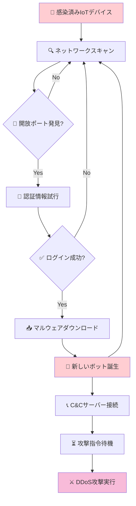
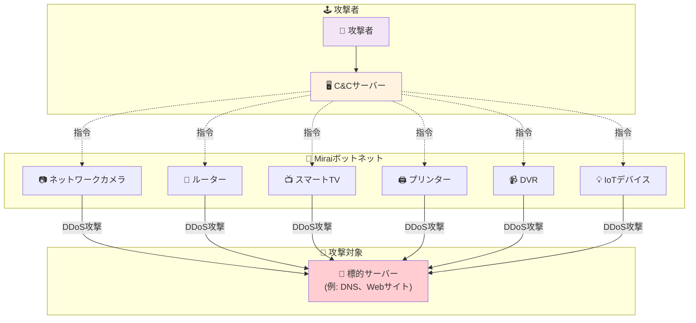
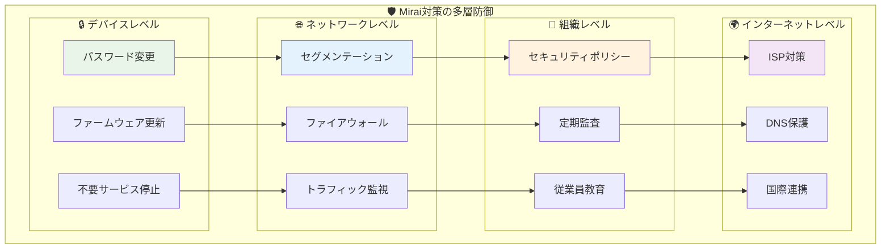

# Miraiマルウェア入門

## 目次
1. [Miraiとは](#miraiとは)
2. [Miraiの歴史と影響](#miraiの歴史と影響)
3. [Miraiの動作原理](#miraiの動作原理)
4. [主要な攻撃事例](#主要な攻撃事例)
5. [感染対象と手法](#感染対象と手法)
6. [対策と予防方法](#対策と予防方法)
7. [現在の状況と派生型](#現在の状況と派生型)
8. [まとめ](#まとめ)

## Miraiとは

**Mirai**（ミライ）は、2016年に初めて確認されたマルウェアで、主に**IoT（Internet of Things）デバイス**を標的とする悪意のあるソフトウェアです。

### 🎯 Miraiの目的

Miraiの主な目的は、感染したIoTデバイスを**ボットネット**に組み込み、大規模な**DDoS（分散型サービス拒否）攻撃**を実行することです。

### 💡 なぜ「Mirai」という名前？

「Mirai」は日本語の「未来」を意味します。作成者が日本のアニメ「未来日記」からインスピレーションを得て命名したとされています。

### 🌐 IoTデバイスが狙われる理由

1. **セキュリティ意識の低さ**: 多くのユーザーがセキュリティ設定を変更しない
2. **デフォルト認証情報**: 初期設定のパスワードが変更されていない
3. **アップデートの困難さ**: ファームウェア更新が簡単でない
4. **数の多さ**: 世界中に数十億台のIoTデバイスが存在

## Miraiの歴史と影響

### 📅 主要な出来事

| 時期 | 出来事 |
|------|--------|
| **2016年8月** | KrebsOnSecurityへの攻撃（620Gbps） |
| **2016年9月** | フランスのホスティング会社OVHへの攻撃（1Tbps） |
| **2016年10月** | DynへのDDoS攻撃でインターネット大規模障害 |
| **2016年10月** | Miraiのソースコードが公開される |
| **2017年以降** | 様々な派生型が登場 |

### 🌍 世界への影響

**2016年10月21日のDyn攻撃**では、以下のような大手サービスが影響を受けました：

- **Twitter** - ツイートの投稿・閲覧が困難に
- **Netflix** - 動画ストリーミングサービスが停止
- **GitHub** - ソースコード管理サービスがアクセス不可
- **Reddit** - 掲示板サイトが利用困難
- **PayPal** - 決済サービスに影響
- **Spotify** - 音楽ストリーミングが停止

この攻撃により、**インターネットインフラの脆弱性**が世界的に認識されるきっかけとなりました。

## Miraiの動作原理

### 🔄 感染サイクル

Miraiは以下の5段階で動作します：

1. **スキャン段階** 🔍
2. **侵入段階** 🚪
3. **感染段階** 🦠
4. **ボットネット参加段階** 🤖
5. **攻撃実行段階** ⚔️



### 詳細な動作フロー

#### 1. 🔍 スキャン段階
- 感染したデバイスがインターネット上の他のIoTデバイスをランダムにスキャン
- Telnet（ポート23）やSSH（ポート22）などの開いているポートを探索
- 1台のボットが1日に数万台のデバイスをスキャン可能

#### 2. 🚪 侵入段階
- 発見したデバイスに対してデフォルトの認証情報を試行
- 事前に用意された**62種類の認証情報リスト**を使用

**よく使われるデフォルト認証情報の例**:
```
admin / admin
admin / password
root / root
admin / 123456
admin / (空白)
```

#### 3. 🦠 感染段階
- 認証に成功したデバイスにマルウェア本体をダウンロード
- デバイスのCPUアーキテクチャ（ARM、MIPS、x86など）に応じた実行ファイルを送信
- 自身を常駐プロセスとして実行

#### 4. 🤖 ボットネット参加段階
- **C&C（Command and Control）サーバー**に接続
- 攻撃者からの指令を待機する状態になる
- 定期的にC&Cサーバーとの接続を維持

#### 5. ⚔️ 攻撃実行段階
- C&Cサーバーからの指令を受けてDDoS攻撃を実行
- 複数の攻撃手法を使い分け：
  - **UDP Flood**: 大量のUDPパケット送信
  - **TCP SYN Flood**: TCP接続要求の大量送信
  - **HTTP Flood**: HTTP リクエストの大量送信

### 🕸️ ボットネット構造とDDoS攻撃



## 主要な攻撃事例

### 🎯 KrebsOnSecurity攻撃（2016年8月）

**被害者**: セキュリティリサーチャーBrian Krebsのウェブサイト
**攻撃規模**: 620Gbps
**影響**: サイトが数日間アクセス不能

**攻撃の背景**:
- Krebsがサイバー犯罪者の身元を暴露する記事を公開
- 報復として大規模なDDoS攻撃を受ける
- 当時としては史上最大級の攻撃規模

### 🏢 OVH攻撃（2016年9月）

**被害者**: フランスのホスティング会社OVH
**攻撃規模**: 1Tbps超
**使用ボット数**: 約15万台
**影響**: 複数の顧客サイトがアクセス困難

### 🌐 Dyn攻撃（2016年10月21日）

**被害者**: DNSプロバイダ「Dyn」
**攻撃規模**: 1.2Tbps
**影響**: インターネット史上最大級の障害

**攻撃の詳細**:
- 3回の波状攻撃（午前、午後、夜間）
- 主にアメリカ東海岸のユーザーに影響
- DNSサービス停止により、多数の大手サイトがアクセス不能

**社会への影響**:
- 電子商取引の損失：数億ドル
- インターネットインフラへの信頼性に疑問
- IoTセキュリティの重要性が世界的に認識

## 感染対象と手法

### 🎯 主な感染対象デバイス

| デバイス種類 | 具体例 | 脆弱性の原因 |
|-------------|--------|-------------|
| **ネットワークカメラ** | 防犯カメラ、Webカメラ | デフォルトパスワード未変更 |
| **ルーター** | 家庭用・企業用ルーター | ファームウェア未更新 |
| **DVR/NVR** | デジタルビデオレコーダー | リモートアクセス機能の脆弱性 |
| **プリンター** | ネットワーク対応プリンター | セキュリティ設定不備 |
| **スマートTV** | インターネット対応テレビ | 組み込みOS の脆弱性 |
| **IoTゲートウェイ** | スマートホームハブ | 認証機能の不備 |

### 🔓 感染手法の詳細

#### デフォルト認証情報攻撃

Miraiが使用する62種類の認証情報には以下のようなパターンがあります：

```
製造業者別のデフォルト設定:
- Dahua製品: admin/admin
- Hikvision製品: admin/12345
- D-Link製品: admin/(空白)
- TP-Link製品: admin/admin

一般的なパターン:
- root/xc3511
- root/vizxv
- root/admin
- admin/smcadmin
- admin/1111
```

#### 自動化された攻撃プロセス

1. **大規模スキャン**: 1時間に数十万IPアドレスをスキャン
2. **並列攻撃**: 複数のデバイスに同時に侵入試行
3. **効率的感染**: 成功率は約1-2%だが、スキャン数が膨大

## 対策と予防方法

### 🛡️ 多層防御アプローチ

Mirai対策には、複数のレベルでの防御が重要です：



### 🛡️ 基本的な対策

#### 1. デフォルト認証情報の変更

**重要度**: ⭐⭐⭐⭐⭐

```
変更すべき項目:
✅ ユーザー名（可能な場合）
✅ パスワード（必須）
✅ 管理者アカウント名
✅ サービスアカウント
```

**強力なパスワードの例**:
- 長さ: 12文字以上
- 複雑さ: 英数字＋記号の組み合わせ
- 一意性: デバイスごとに異なるパスワード

#### 2. ファームウェアの定期更新

**更新頻度**: 月1回以上の確認を推奨

```
更新手順:
1. メーカーサイトで最新版を確認
2. セキュリティパッチの有無を確認
3. 自動更新機能の有効化（可能な場合）
4. 更新後の動作確認
```

#### 3. 不要なサービスの無効化

**無効化すべきサービス**:
- Telnet（ポート23）
- 不要なSSH（ポート22）
- UPnP（セキュリティリスクが高い場合）
- WPS（Wi-Fiルーター）

### 🔒 高度な対策

#### ネットワークセグメンテーション

```
推奨ネットワーク構成:
┌─────────────────┐
│   インターネット   │
└─────────┬───────┘
          │
    ┌─────┴─────┐
    │ ファイアウォール │
    └─────┬─────┘
          │
    ┌─────┴─────┐
    │ 基幹ネットワーク │
    └─────┬─────┘
          │
    ┌─────┴─────┐
    │ IoTネットワーク │
    │  (分離された)   │
    └───────────┘
```

#### トラフィック監視

**監視すべき項目**:
- 異常な外部通信
- 大量のスキャン活動
- 不審なポート通信
- C&Cサーバーとの通信

### 🏢 企業向け対策

#### 1. IoTデバイス管理ポリシー

```
管理項目:
□ デバイス一覧の管理
□ セキュリティパッチ適用状況
□ アクセス権限の管理
□ 定期的なセキュリティ監査
□ インシデント対応計画
```

#### 2. ネットワークアクセス制御（NAC）

- デバイス認証の強化
- 未知デバイスの自動隔離
- 通信ポリシーの適用

#### 3. セキュリティ意識向上

**従業員教育項目**:
- IoTデバイスのセキュリティリスク
- 適切な設定方法
- インシデント報告手順

## 現在の状況と派生型

### 🔄 Mirai派生型の登場

Miraiのソースコードが2016年10月に公開されて以降、多数の派生型が登場しています：

#### 主要な派生型

| 派生型名 | 特徴 | 登場時期 |
|---------|------|---------|
| **Satori** | 脆弱性悪用を追加 | 2017年 |
| **Okiru** | ARC CPUに対応 | 2018年 |
| **Echobot** | 新しい脆弱性を多数悪用 | 2019年 |
| **Mozi** | P2P通信を採用 | 2019年 |
| **Dark Mirai** | ランサムウェア機能追加 | 2020年 |

### 📈 現在の脅威レベル

**2024年現在の状況**:
- IoTデバイス数: 世界で300億台以上
- 新しい脆弱性: 毎月数十件発見
- ボットネット規模: 数百万台規模が複数存在

### 🔮 将来の脅威予測

1. **5G環境での脅威拡大**
   - より多くのデバイスがインターネット接続
   - 攻撃規模の更なる拡大

2. **AI技術の悪用**
   - 機械学習による攻撃効率化
   - 防御回避技術の高度化

3. **新しい攻撃対象**
   - 自動車のコネクテッド機能
   - 産業用IoT（IIoT）システム
   - スマートシティインフラ

## まとめ

### 🎯 重要なポイント

1. **Miraiは現在も活動中の脅威**
   - 2016年の登場以降、派生型が継続的に出現
   - IoTデバイスの増加とともに脅威も拡大

2. **基本対策の重要性**
   - デフォルトパスワードの変更だけで大幅にリスク軽減
   - 定期的なファームウェア更新が必須

3. **ネットワークレベルでの対策**
   - セグメンテーションによる被害拡大防止
   - トラフィック監視による早期検知

4. **継続的な警戒が必要**
   - 新しいIoTデバイス導入時のセキュリティチェック
   - セキュリティ情報の定期的な確認

### 📚 学習のススメ

Miraiマルウェアを理解することで：
- **IoTセキュリティの重要性**を実感
- **ボットネット攻撃の仕組み**を理解
- **適切な防御策**を実装可能

### 🔗 追加学習リソース

- [JPCERT/CC IoTセキュリティガイドライン](https://www.jpcert.or.jp/)
- [NISC IoTセキュリティ対策](https://www.nisc.go.jp/)
- [IPA 情報セキュリティ対策](https://www.ipa.go.jp/)

---

## 用語集

- **ボットネット**: 悪意のあるソフトウェアに感染した複数のコンピューターで構成されるネットワーク
- **DDoS攻撃**: 複数のコンピューターから同時に攻撃を行い、サーバーを過負荷状態にする攻撃手法
- **C&Cサーバー**: ボットネットを制御するためのコマンド・アンド・コントロールサーバー
- **IoT**: Internet of Things（モノのインターネット）
- **Telnet**: リモートログインのためのプロトコル（セキュリティが弱い）
- **ファームウェア**: デバイスの基本動作を制御するソフトウェア

## 参考資料

- [US-CERT Mirai Malware Alert](https://www.cisa.gov/news-events/alerts/2016/11/02/mirai-malware)
- [Krebs on Security - The Democratization of Censorship](https://krebsonsecurity.com/)
- [NIST Cybersecurity Framework](https://www.nist.gov/cyberframework)
