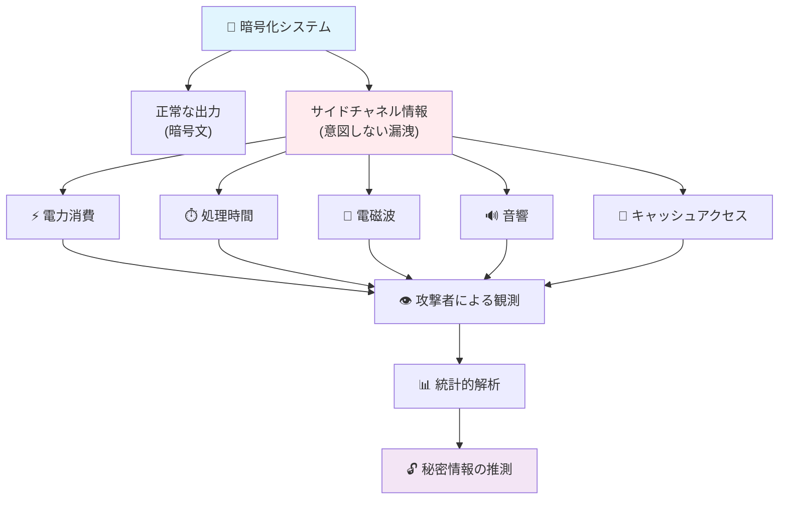
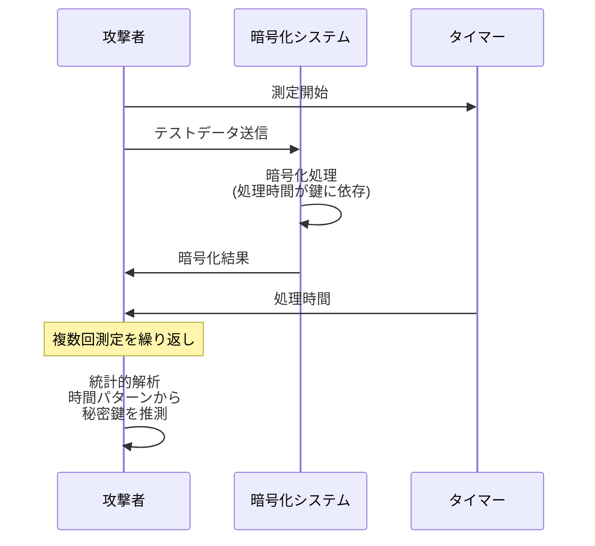
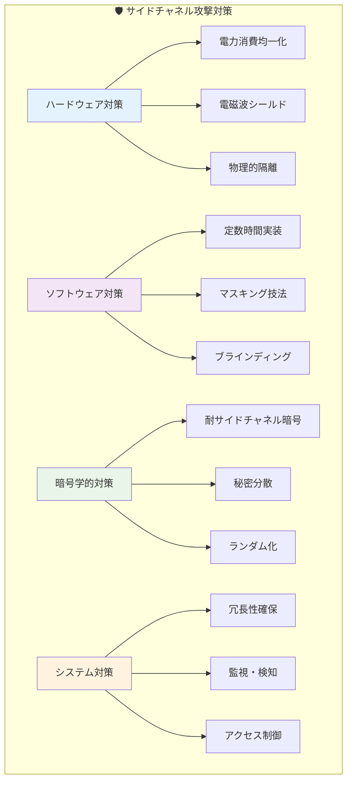

# サイドチャネル攻撃入門

## 目次
1. [サイドチャネル攻撃とは](#サイドチャネル攻撃とは)
2. [サイドチャネル攻撃の仕組み](#サイドチャネル攻撃の仕組み)
3. [主な攻撃手法](#主な攻撃手法)
4. [具体的な攻撃例](#具体的な攻撃例)
5. [対策方法](#対策方法)
6. [まとめ](#まとめ)

## サイドチャネル攻撃とは

**サイドチャネル攻撃**（Side-Channel Attack）は、暗号システムやセキュリティシステムの実装における物理的な情報漏洩を利用した攻撃手法です。

### 🔍 なぜ「サイドチャネル」と呼ばれるのか？

通常のセキュリティ攻撃は、システムの正面から直接攻撃を仕掛けます（例：パスワードクラッキング、SQLインジェクションなど）。

一方、サイドチャネル攻撃は、システムが動作する際に**意図せずに発生する副次的な情報**（サイドチャネル情報）を観測して攻撃を行います。まさに「裏口」や「横道」から攻撃するイメージです。

### 💡 身近な例で理解しよう

想像してみてください：
- 金庫のダイヤルを回す音を聞いて暗証番号を推測する
- ATMのキーパッドを押す際の手の動きを観察してPINコードを盗む
- パソコンの動作音や発熱パターンから処理内容を推測する

これらはすべてサイドチャネル攻撃の考え方です。

## サイドチャネル攻撃の仕組み

### 基本原理



### 攻撃が成功する条件

1. **観測可能性**: サイドチャネル情報が外部から観測できること
2. **相関性**: 観測した情報と秘密情報の間に相関があること
3. **再現性**: 同じ条件で繰り返し観測できること

## 主な攻撃手法

### 1. ⚡ 電力解析攻撃（Power Analysis Attack）

**概要**: デバイスの消費電力パターンを解析して秘密情報を推測

**仕組み**:
- 暗号化処理中の消費電力を測定
- 処理するデータによって消費電力が変化することを利用
- 統計的解析により暗号鍵を推定

**攻撃タイプ**:
- **SPA（Simple Power Analysis）**: 単一の電力波形から直接情報を読み取る
- **DPA（Differential Power Analysis）**: 複数の測定結果を統計的に解析

### 2. ⏱️ タイミング攻撃（Timing Attack）

**概要**: 処理時間の違いを利用して秘密情報を推測

**仕組み**:
- 暗号化・認証処理の実行時間を測定
- 入力データによって処理時間が変化することを利用
- 時間差から秘密情報を推定



### 3. 📡 電磁波解析攻撃（Electromagnetic Analysis Attack）

**概要**: デバイスから放射される電磁波を解析

**仕組み**:
- 処理中に発生する電磁波をアンテナで受信
- 電磁波のパターンから処理内容を推測
- 遠距離からの攻撃も可能

### 4. 🔊 音響攻撃（Acoustic Attack）

**概要**: デバイスが発する音を解析

**仕組み**:
- CPUやハードディスクの動作音を録音
- 音のパターンから処理内容を推測
- キーボードのタイピング音からパスワードを推測

### 5. 💾 キャッシュ攻撃（Cache Attack）

**概要**: CPUキャッシュのアクセスパターンを利用

**仕組み**:
- メモリアクセスの時間差を測定
- キャッシュヒット/ミスのパターンから情報を推測
- 仮想環境での攻撃も可能

## 具体的な攻撃例

### 例1: RSA暗号に対するタイミング攻撃

```python
# 脆弱な実装例（疑似コード）
def rsa_decrypt(ciphertext, private_key):
    start_time = time.now()
    
    # 秘密鍵を使った復号処理
    # 鍵の値によって処理時間が変化
    result = pow(ciphertext, private_key, modulus)
    
    end_time = time.now()
    return result

# 攻撃者の観測
execution_times = []
for test_input in test_inputs:
    start = time.now()
    rsa_decrypt(test_input, unknown_key)
    end = time.now()
    execution_times.append(end - start)

# 時間パターンから秘密鍵を推測
```

### 例2: AES暗号に対する電力解析攻撃

1. **測定段階**: スマートカードでAES暗号化を実行し、消費電力を測定
2. **解析段階**: 電力波形と暗号鍵の相関を統計的に解析
3. **推定段階**: 最も相関の高い鍵候補を特定

### 例3: キーボード音響攻撃

1. **録音**: キーボードのタイピング音をマイクで録音
2. **分析**: 各キーの音の特徴（周波数、強度など）を解析
3. **推測**: 音のパターンからタイプされた文字列を復元

## 対策方法



### 1. 🛡️ ハードウェア対策

**電力解析攻撃への対策**:
- **電力消費の均一化**: 処理内容に関係なく一定の電力を消費
- **ランダムノイズの追加**: 意図的にノイズを発生させて解析を困難にする
- **デカップリング**: 電源とグラウンドを適切に分離

**電磁波攻撃への対策**:
- **シールド**: 電磁波を遮断するケースやフィルターの使用
- **フェライトコア**: 電磁ノイズの抑制

### 2. 💻 ソフトウェア対策

**タイミング攻撃への対策**:
```python
# 定数時間実装の例
def constant_time_compare(a, b):
    """定数時間での文字列比較"""
    if len(a) != len(b):
        return False
    
    result = 0
    for x, y in zip(a, b):
        result |= ord(x) ^ ord(y)
    
    return result == 0  # 常に同じ時間で完了
```

**キャッシュ攻撃への対策**:
- **テーブルルックアップの回避**: データ依存のメモリアクセスを避ける
- **マスキング**: 中間値をランダム値でマスク

### 3. 🔐 暗号学的対策

**マスキング技法**:
```
真の値 = マスクされた値 ⊕ マスク値
```

**ブラインディング技法**:
- 計算前にランダム値を加算
- 計算後にランダム値を減算

### 4. 🏗️ アーキテクチャ対策

**分離と隔離**:
- 重要な処理を専用ハードウェアで実行
- 仮想化技術による隔離
- セキュアエレメントの使用

**冗長性**:
- 複数の独立した実装を並列実行
- 結果の一致性を確認

## まとめ

### 🎯 重要なポイント

1. **サイドチャネル攻撃は物理的な情報漏洩を利用する攻撃手法**
2. **従来のセキュリティ対策では防げない場合がある**
3. **ハードウェアとソフトウェア両方の対策が必要**
4. **完全な防御は困難だが、攻撃コストを上げることは可能**

### 📈 今後の動向

- **IoTデバイスの普及**: より多くのデバイスが攻撃対象に
- **AI技術の活用**: 機械学習による攻撃精度の向上
- **量子コンピューティング**: 新たな攻撃・防御手法の登場

### 🔍 学習のススメ

サイドチャネル攻撃を理解することで：
- セキュリティ設計の重要性を実感
- 物理的セキュリティの必要性を理解
- より堅牢なシステム構築が可能

---

## 参考資料

- [NIST SP 800-57: Recommendation for Key Management](https://csrc.nist.gov/publications/detail/sp/800-57-part-1/rev-5/final)
- [Common Criteria for Information Technology Security Evaluation](https://www.commoncriteriaportal.org/)
- [Side-Channel Attack Standard Evaluation Board (SASEBO)](http://www.risec.aist.go.jp/project/sasebo/)

## 用語集

- **DPA**: Differential Power Analysis（差分電力解析）
- **SPA**: Simple Power Analysis（単純電力解析）
- **CPA**: Correlation Power Analysis（相関電力解析）
- **EMA**: Electromagnetic Analysis（電磁波解析）
- **HSM**: Hardware Security Module（ハードウェアセキュリティモジュール）
